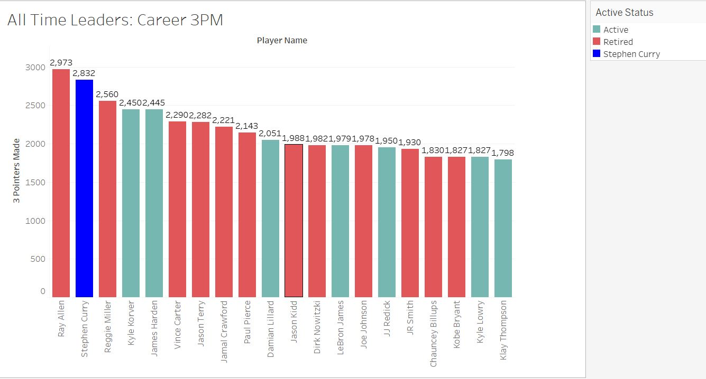
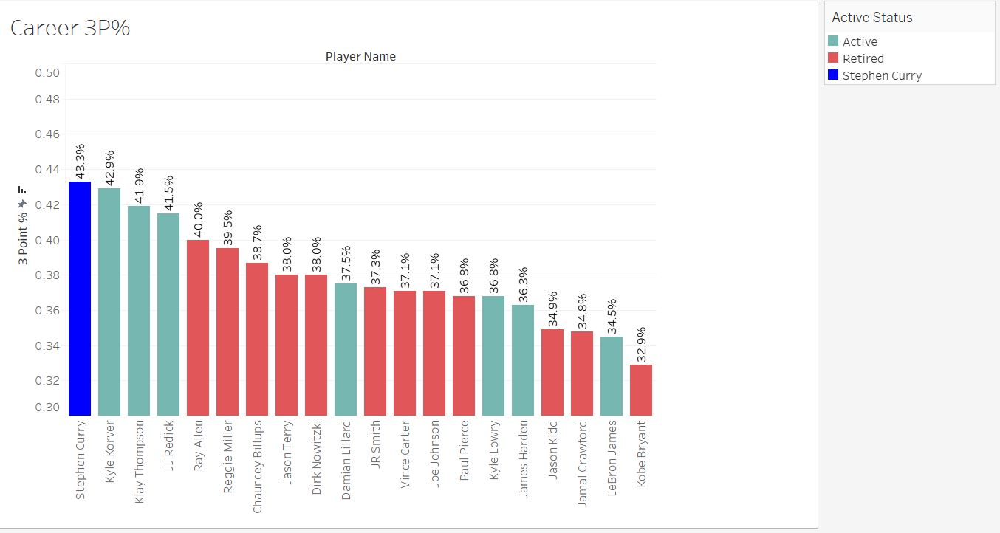
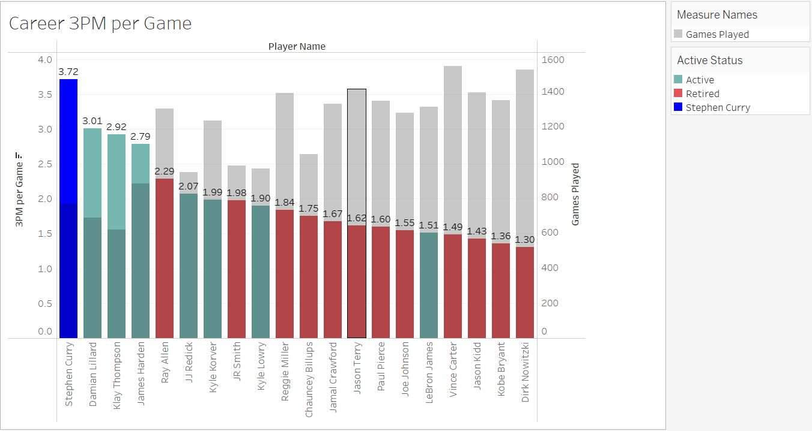

## Introduction
** Disclaimer: This project was created in November 2021 and the statistics have not been kept up to date so certain statistics in this project may be outdated / incorrect **

This is one of the projects that I completed for a Boot Camp at the University of Pennsylvania. In this project I wanted to answer the question who is the greatest 3-point shooter of all time?
Obviously it is Steph Curry, but I wanted to show that mathematically because as the saying goes "numbers don't lie".

#### See my powerpoint presentation seebeck_P3.pptx
#### Also see my tableau story seebeck_P3b.twb

## System Requirements
- Microsoft Powerpoint
- Microsoft Excel 
- Jupyter Lab
- Tableau
- Python (version 3 or later required)

## Python Libraries Required 
- beautifulsoup4
- requests
- splinter
- webdriver_manager.chrome
- pandas
- json

## Collecting the Data (2 methods)
1. Using splinter and BeautifulSoup in Python to scrape data from different websites
- Websites Used
  - https://www.nba.com
  - https://www.landofbasketball.com
  - https://www.basketball-reference.com 
  
2. Using nba_api to pull in NBA stats
- User created python library with a description "An API Client package to access the APIs for NBA.com"
- https://github.com/swar/nba_api/blob/master/docs/table_of_contents.md 

## Data Analysis 
All of the data analysis in this repo is done within the "Shot Chart.ipynb" file. However, the best way to visualize the results of the data analysis is to look at the tableau file. 

There are a lot of different angles that you can take to answer the question. Who is greatest 3 pointer shooter of all time? The first thing that I decided to look at was all time leaders in Career 3 Pointers Made (note refer to disclaimer above if statistics are outdated)

#### All Time Leaders in Career 3 Pointers Made (3PM Top 20)

You can see that Steph Curry is 2nd place on this list behind only Ray Allen. However, Ray Allen, like many other plays on the list, is retired so his numbers will remain the same whereas Steph's numbers, like other players on the list, is active so his numbers will continue to increase. This points out of the two major flaws of using this list as the end all be all for who is the greatest 3 pointer shooter in NBA history. The first flaw is that the list fails to consider 3P% which is important because you want a sharpshooter like JJ Reddick who makes a high percentage of his 3 pointers not someone who heaves up a lot of 3 pointers but does not make many of them like Rusell Westbrook. The second flaw is that the list puts too much weigh on the length of a players career. It is unfair to compare Klay Thompson to Ray Allen based solely on career 3 pointers made because Ray Allen has played more than twice as many games as Klay. 

That being said I decided to look at the list differently. **Using the same 20 players as the chart above** I plotted their 3P% and 3 pointers made per game. 

Out of the 20 players with the most career 3 pointers made, Steph Curry leads in both career 3P% and career 3 pointers made per game (by a substantial margin). 
**Note: Remember these charts are not looking at all NBA players just the 20 who lead in career 3PM**

These charts led me to another question, who leads the NBA in career 3 pointers made per game. 

Insert Image here

Steph Curry leads the NBA in career 3 pointers made per game. Additionally, looking at the chart of total 3 pointers made vs number of seasons played extrapolation shows that Steph Curry is on pace to become the leader in career 3PM by a margin (obviously there is a potential that injuries throw a wrench in this but that is very unlikely). Another interesting takeaway from the chart is that many active players including James Harden, Damian Lillard, Klay Thompson, Donovan Mitchell, and even Buddy Hield are all on pace to pass Ray Allen for career 3PM assuming they maintain the same pace of 3 pointers made each season and they have a very long career like Ray Allen did. 

The fact that 9 out of 10 players on the list for career 3 pointers made per game shows that the NBA today takes more 3 pointers than it ever has in the past. To look at this in more detail lets look at total 3PM per season over the history of the NBA.

Insert Image Here

You can see that the number of 3 pointers made per season has steadily increased from when it was introduced in 1980 (which the exception of a spike from 1994 to 1996 when the number of 3 pointers made in a season shot up because the league moved the 3 point line from 23 feet 9 inches to 22 feet. After the line was moved back to 23 feet 9 inches and it has remained at that length since). 

However, even though the number of 3 pointers made in a season has increased over the history of the NBA that does tnot mean that 3 point accuracy has increased as well. In fact the total 3 point % during a season has remained very similar over the years (See chart below) 

Insert Image Here
